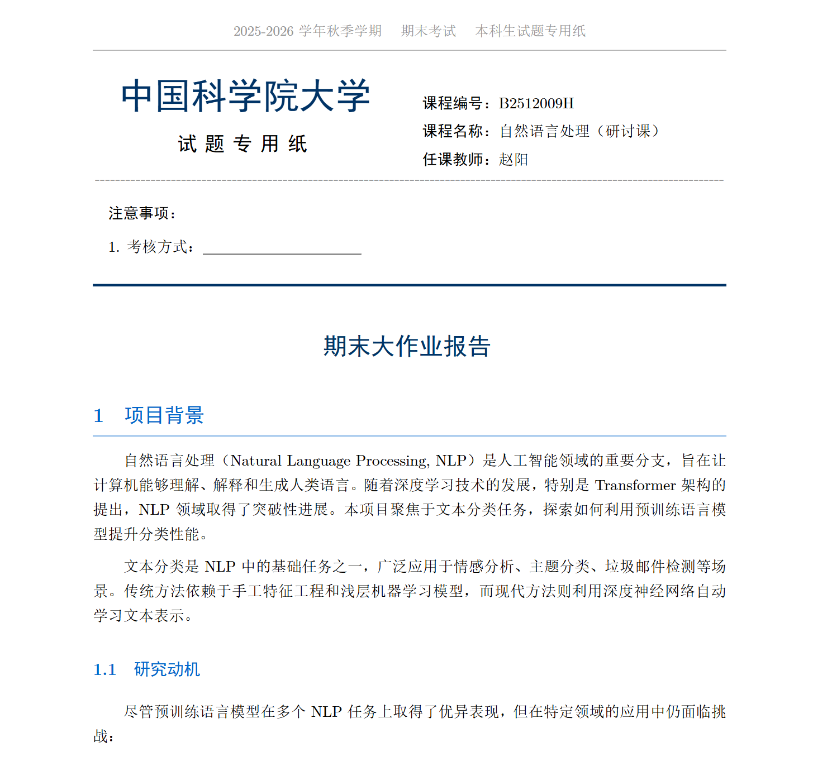

# 自然语言处理课程作业集

本仓库包含自然语言处理研讨课（实践课）的全部课程作业，涵盖从基础的文本处理到深度学习模型的完整NLP流程。

## 项目预览

### 期末报告模板效果

<div align="center">
  
  <p><i>专业的LaTeX学术报告模板，符合中国科学院大学格式要求</i></p>
</div>

---

## 作业列表

### 0. 期末报告模板 (`期末报告模板/`)

**模板特点**: 专业的LaTeX学术报告模板

- 符合中国科学院大学试题专用纸格式
- 完整的页眉页脚设计
- 自定义标题样式和颜色主题
- 支持中文排版、数学公式、图表
- 包含完整的NLP项目示例内容
- 开箱即用，可直接修改

**使用方式**: 
```bash
cd 期末报告模板
xelatex report.tex
```

---

### 1. 文本爬取与词向量 (`1/`)

**作业内容**: 从数据采集到词向量训练的完整流程

- 网络爬虫（古登堡计划、新浪新闻）
- 文本预处理（分词、停用词过滤）
- 统计分析（词频分布、齐夫定律验证）
- Word2Vec训练（Skip-gram vs CBOW）
- 对比实验（领域、算法、超参数）

**主要成果**: 
- 英文语料138万词，中文语料80万词
- 验证齐夫定律，揭示词向量语义漂移现象

---

### 2. 文本分类 (`TextClassification/`)

**作业内容**: TextCNN与BERT文本分类对比实验

- TextCNN模型实现（多尺度卷积）
- 系统性超参数优化（23组实验）
- 模型复杂度对比（4个版本）
- BERT预训练模型微调

**主要成果**:
- TextCNN最佳准确率: **89.00%**
- BERT准确率: **93.00%**
- 发现num_channels参数提升5.27%性能
- 证明简单模型在小数据集上更有效

---

### 3. 序列标注 (`SequenceLabeling/`)

**作业内容**: 中文命名实体识别（NER）

- BiLSTM-CRF模型实现
- BIO标注体系
- 模型优化（LayerNorm、梯度裁剪、学习率调度）
- BERT预训练模型对比
- 维特比解码算法

**主要成果**:
- BiLSTM-CRF优化后验证集F1: **90.40%**
- BERT测试集F1: **91.52%**
- 优化措施提升1.76%性能

---

### 4. 机器翻译 (`MachineTranslation/`)

**作业内容**: 英译中神经机器翻译

- Transformer从零实现（Encoder-Decoder）
- 多头注意力机制
- 位置编码与掩码机制
- mBART-50预训练模型
- BLEU评估

**主要成果**:
- mBART-50 BLEU: **0.51**
- Transformer从零训练BLEU: 0.03
- 预训练模型性能是从零训练的17倍

---

### 5. 大语言模型API (`LLM/`)

**作业内容**: LLM API调用实践

- API接口调用与测试
- HTTP请求配置
- 错误处理（403绕过）
- 训练数据格式准备（JSONL）

---

## 技术栈

- **深度学习框架**: PyTorch
- **预训练模型**: HuggingFace Transformers (BERT, mBART)
- **文本处理**: jieba, NLTK, Gensim
- **数据处理**: NumPy, Pandas
- **可视化**: Matplotlib, WordCloud
- **硬件**: NVIDIA RTX 4090 (24GB)

## 核心发现

1. **预训练的重要性**: 在所有任务中，预训练模型都显著优于从零训练
   - 文本分类: BERT (93%) vs TextCNN (89%)
   - 序列标注: BERT (91.52%) vs BiLSTM-CRF (83.73%)
   - 机器翻译: mBART BLEU是从零训练的17倍

2. **简单有时更好**: 在小数据集上，简单模型往往优于复杂模型
   - TextCNN增加复杂度导致准确率从89%降至67%
   - 过度复杂化导致严重过拟合

3. **超参数的影响**: 关键超参数的选择至关重要
   - TextCNN的num_channels提升5.27%
   - BiLSTM-CRF的优化措施提升1.76%

4. **数据质量**: 数据预处理和格式处理对模型性能影响显著
   - BPE分词痕迹影响翻译质量
   - 动态批次填充提升训练效率20%

## 项目结构

```
.
├── 1/                      # 文本爬取与词向量
├── TextClassification/     # 文本分类
├── SequenceLabeling/       # 序列标注
├── MachineTranslation/     # 机器翻译
├── LLM/                    # 大语言模型API
└── README.md               # 本文件
```

## 运行环境

- Python 3.8+
- PyTorch 1.12+
- CUDA 11.6+ (推荐RTX 4090或同等GPU)
- 24GB+ GPU显存（用于BERT/mBART训练）

## 安装依赖

每个项目目录下都有独立的依赖说明，通常可以通过以下方式安装：

```bash
pip install torch transformers datasets jieba nltk gensim matplotlib wordcloud sacrebleu
```

## 作者

潘宇轩  
2025年12月

## 许可

本项目仅用于学习和研究目的。
